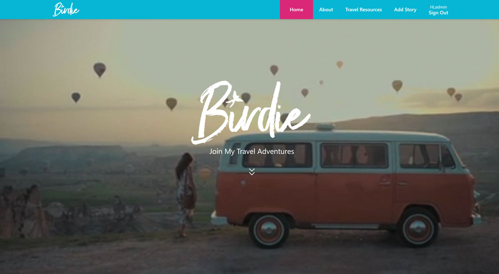
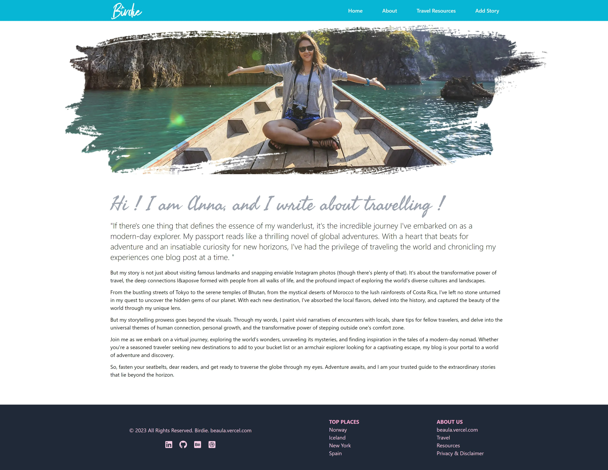
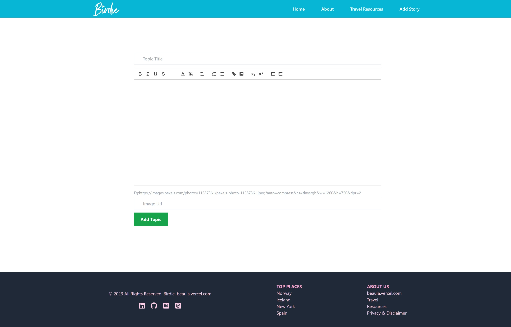
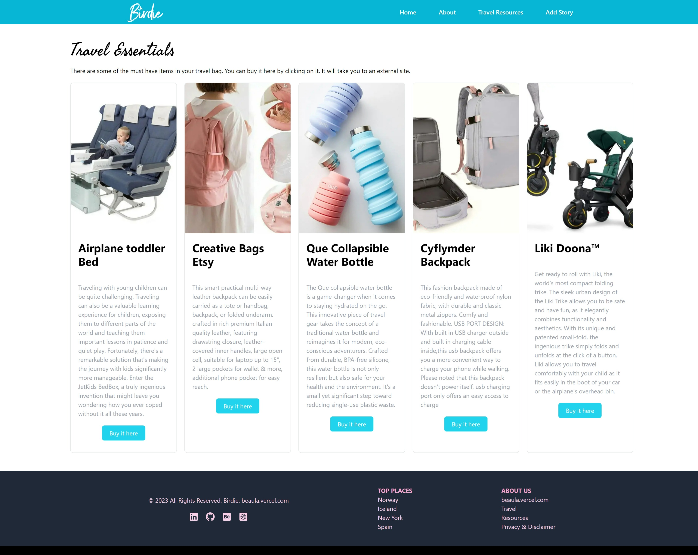

# Birdy-My Travel Blog

[https://birdie-mytravelblog.vercel.app/](https://birdie-mytravelblog.vercel.app/)

🌍 Exciting News! Introducing 'Birdie - My Travel Blog' 🦜✈️ I'm thrilled to share my latest project, a dynamic travel blog where you have the power to add, delete, and edit your travel stories seamlessly. 🚀 The website, fully backed by MongoDB, ensures a robust and efficient data management system.

Express your travel tales with freedom using React Quill's rich text editor, allowing you to format your posts just the way you envision them! 📝✨ Whether you're a seasoned explorer or dreaming of your next adventure, Birdie is the perfect platform to share your journey.

# Table of contents

- [Overview](#overview)
- [Screenshots](#screenshot)
- [Live site](#live-site)
- [My Process](#my-process)
- [What I Learnt](#what-i-learned)
- [Continued Development](#continued-development)
- [Author](#author)

## Screenshot







## My Process

- [Built with](#built-with)
- [What I Learned](#what-i-learned)
- [Continued development](#continued-development)

## Built With

### Frontend:

    - ⚛️ React: Leveraged React to build the user interface for Birdie, ensuring a responsive and interactive experience.
    - 🌐 react-router-dom: A library for routing and navigation in React applications.
    - 📑 React Quill: Integrated the rich text editor to empower users to format their travel stories with ease.
    - 🔑 NextAuth.js: Implemented NextAuth.js for user authentication, allowing users to create accounts and manage their profiles securely.
    - ⚖️ HTML5 & CSS3: Used modern web technologies for structuring and styling the content, providing a visually appealing layout.
    - 🔨 CRUD Functionality: Integrated CRUD operations on the frontend to enable users to create, read, update, and delete their travel stories.

### Backend:

- ⚒️ Authentication:
  NextAuth.js: Integrated NextAuth.js on the backend to handle user authentication seamlessly. Utilized its flexible authentication providers for a customizable authentication flow.

- 🧲 Database:
  MongoDB: Implemented MongoDB as the backend database to store and retrieve user profiles and travel stories securely.
  Node.js: Powered the backend with Node.js to handle server-side logic, including authentication flows, CRUD operations, and data management.
  Express.js: Utilized Express.js to streamline the development of the backend, facilitating the creation of RESTful APIs.

- 🪛 CRUD Functionality:

  #### Create:

  Implemented functionality for users to create new travel stories, including text content and multimedia elements.

  #### Read:

  Developed features to allow users to view their own travel stories and those shared by others.

  #### Update:

  Enabled users to edit and update their existing travel stories with the latest information and experiences.

  #### Delete:

  Implemented secure deletion of travel stories, ensuring users have control over the content they share on Birdie.

### Deployment:

Deployed the application to a hosting service of choice (e.g., Heroku, Netlify) for accessibility to users worldwide.

## What I Learned

Throughout the development of this project, I gained a comprehensive understanding of React and its role in crafting dynamic user interfaces. Leveraging the React library, I learned to build a responsive and interactive frontend for Birdie - My Travel Blog, allowing users to seamlessly express and share their travel tales. Additionally, the integration of react-router-dom facilitated efficient navigation within the application, enhancing the overall user experience.

On the backend, I delved into user authentication using NextAuth.js, implementing a secure system for account creation and profile management. This not only ensured the protection of user data but also laid the foundation for a personalized and secure environment. The utilization of modern web technologies such as HTML5 and CSS3 further contributed to the project's visual appeal. Finally, the incorporation of CRUD functionality empowered users to effortlessly manage their travel stories, covering the full spectrum from creation to deletion, enriching my understanding of full-stack development.

## Continued Development

Birdie - My Travel Blog is an ongoing project, and I have plans for further enhancements:

Version History:
Consider implementing version history for travel stories, allowing users to track and revert to previous versions of their content.

Collaborative Editing:
Explore collaborative editing features, enabling multiple users to contribute to and edit a travel story.

Advanced Filtering:
Implement advanced filtering options to help users discover and explore travel stories based on various criteria.

I'm excited about the comprehensive content management capabilities that CRUD functionality brings to Birdie - My Travel Blog! 🌍🦜✈️

## Author

- Linkedin - [Beaula Ekka-linkedin](https://www.linkedin.com/in/beaula-ekka-favejee-97316558/)

This is a [Next.js](https://nextjs.org/) project bootstrapped with [`create-next-app`](https://github.com/vercel/next.js/tree/canary/packages/create-next-app).

## Getting Started

First, run the development server:

```bash
npm run dev
# or
yarn dev
# or
pnpm dev
```

Open [http://localhost:3000](http://localhost:3000) with your browser to see the result.

You can start editing the page by modifying `app/page.js`. The page auto-updates as you edit the file.

This project uses [`next/font`](https://nextjs.org/docs/basic-features/font-optimization) to automatically optimize and load Inter, a custom Google Font.

## Learn More

To learn more about Next.js, take a look at the following resources:

- [Next.js Documentation](https://nextjs.org/docs) - learn about Next.js features and API.
- [Learn Next.js](https://nextjs.org/learn) - an interactive Next.js tutorial.

You can check out [the Next.js GitHub repository](https://github.com/vercel/next.js/) - your feedback and contributions are welcome!

## Deploy on Vercel

The easiest way to deploy your Next.js app is to use the [Vercel Platform](https://vercel.com/new?utm_medium=default-template&filter=next.js&utm_source=create-next-app&utm_campaign=create-next-app-readme) from the creators of Next.js.

Check out our [Next.js deployment documentation](https://nextjs.org/docs/deployment) for more details.
